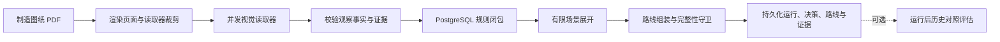
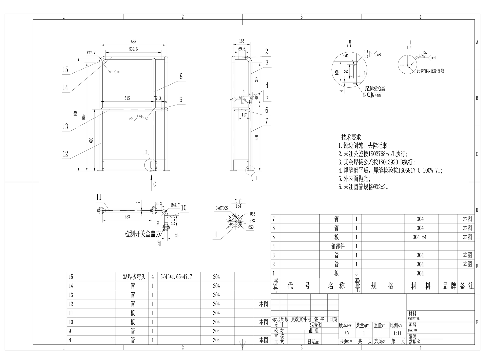
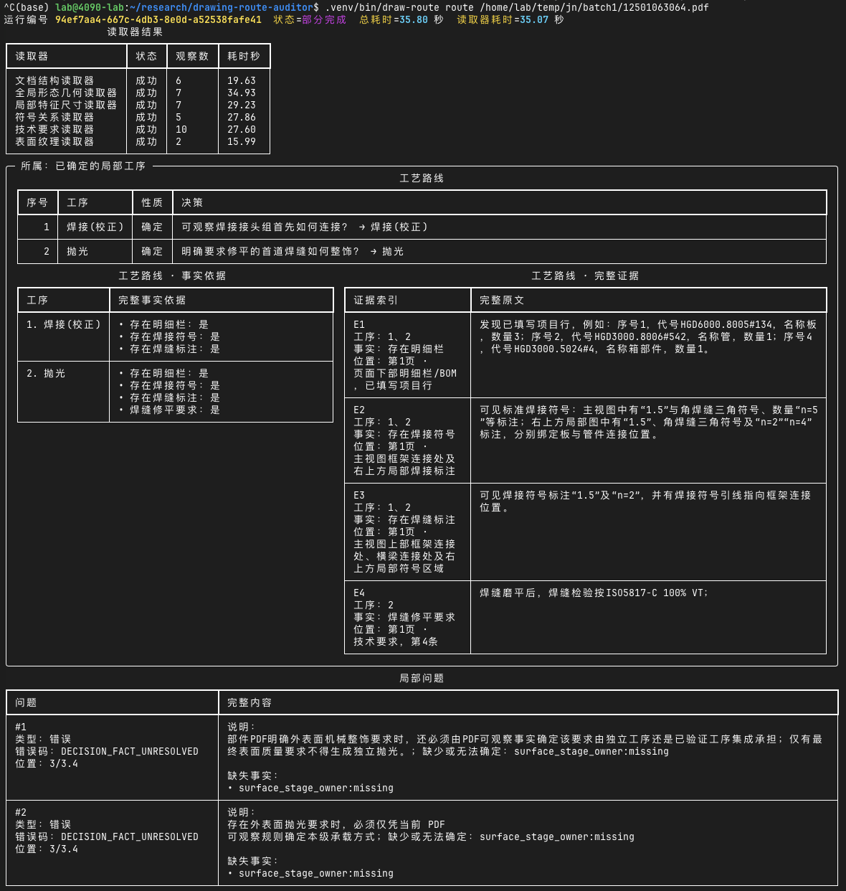

# 图纸工艺路线审计器

一个以证据为先的原型系统：从制造图纸 PDF 生成可审计的工艺路线建议。

系统先渲染 PDF，再由多个专业视觉读取器提取边界明确的图纸观察事实，随后在
PostgreSQL 中执行确定性规则，最终返回单一路线、有限候选路线，或明确的部分完成/错误结果。
系统会保留不确定性，不用猜测填补证据缺口。

> **当前状态：** 开发与评估原型。系统不会回写 PLM/ERP，也不能在无人复核的情况下
> 直接用于生产工艺放行。

## 项目目标

直接让视觉模型编写制造工艺路线，往往难以审计，也容易对样本身份产生过拟合。
本项目将问题拆成两个层次：

1. **感知层：** 视觉读取器只报告工艺中立的观察事实，例如原材料形态、孔槽拓扑、
   公差、焊接符号和明确的表面要求。
2. **决策层：** 带版本的规则把观察事实映射为路线族和具体工序。

因此，每一道输出工序都能沿规则追溯到支持它的页码、区域和图纸原文。

## 核心特点

- 纯 PDF 推理契约：文件名、标识符和历史答案不能选择路线。
- 6 个职责独立的读取器并发工作，并使用针对性的高分辨率视图。
- 四态事实模型：`hit`、`not_hit`、`unable_to_judge`、`conflict`。
- 每条事实必须记录页码、区域、原文和观察覆盖状态。
- PostgreSQL 确定性规则求值，每次运行固定到具体决策树修订。
- 知识更新采用原子化写时复制，不覆盖已有修订。
- 明确区分完整、候选、部分完成和错误结果。
- 同时提供便于人工阅读的 Rich 终端输出和稳定 JSON 输出。
- 历史路线只能在建议及其证据持久化之后加载，用于后置评估。

## 推理流程



## 真实图纸运行结果

- [打开脱敏图纸](docs/demo/welded-frame-assembly.pdf)
- [查看完整 JSON 结果](docs/demo/run-result.json)
- [打开高分辨率图纸预览](docs/assets/welded-frame-assembly.png)



```bash
draw-route route docs/demo/welded-frame-assembly.pdf
```



**正确工艺路线：** `焊接(校正) -> 抛光 -> 转装配`

**说明：** 转序由上级图号确定。

## 读取器职责

| 读取器 | 观察内容 |
|---|---|
| 文档结构 | 主标题栏、材料、数量、明细栏是否存在、技术要求区域是否存在 |
| 全局几何 | 原材料形态、回转面或卷制面、轴对称轮廓、全局公差 |
| 局部几何 | 折弯、孔、槽、螺纹孔组合、棱柱凹槽 |
| 符号关系 | 焊接符号、焊缝标注、装配关系、精密内圆面 |
| 技术要求 | 清洗、防腐、局部焊缝整饰、分阶段加工文字 |
| 表面纹理 | 全局粗糙度符号和数值粗糙度 |

读取器契约来自 PostgreSQL 中当前生效的决策树修订。读取器不能增加契约外字段，
也不能直接输出工序答案。

## 环境要求

- Python 3.13 或更高版本
- PostgreSQL 17
- `PATH` 中可用的 Poppler `pdftoppm`
- 兼容 OpenAI 接口、支持视觉输入的模型端点
- Docker Compose（使用仓库自带的本地 PostgreSQL 服务时需要）

## 安装

```bash
python3.13 -m venv .venv
.venv/bin/pip install -e '.[dev]'
cp .env.example .env
```

在 `.env` 中配置模型端点：

```dotenv
OPENAI_BASE_URL=https://example.invalid/v1
OPENAI_API_KEY=replace-me
MODEL=vision-model-name
```

启动 PostgreSQL，并初始化数据库结构和规则树：

```bash
docker compose up -d postgres
.venv/bin/draw-route db wait
.venv/bin/draw-route db migrate
.venv/bin/draw-route tree init docs/decision_tree.json
.venv/bin/draw-route tree validate --strict
.venv/bin/draw-route doctor
```

## 生成路线

主要冒烟测试接口只接收一个 PDF：

```bash
.venv/bin/draw-route route /path/to/drawing.pdf
```

输出机器可读的 JSON：

```bash
.venv/bin/draw-route route /path/to/drawing.pdf --format json
```

自动化场景中要求路线必须完整：

```bash
.venv/bin/draw-route route /path/to/drawing.pdf --require-complete
```

当建议为部分完成或其他非完整状态时，`--require-complete` 以状态码 `3` 退出。

## 建议状态

| 状态 | 含义 |
|---|---|
| `complete` | 只有一条完整路线，且没有未解决的局部问题 |
| `complete_with_candidates` | 基础路线完整，同时存在有限且允许的候选差异 |
| `partial` | 只确认有证据支持的工序，必要事实仍未解决 |
| `error` | 无法组装可用路线，或完整性守卫阻止结果 |

每一道输出工序都包含规则键、所选决策、其他选项、决定性事实、证据位置和固定的决策树修订。

## 决策树维护

运行时推理始终使用 PostgreSQL 中当前生效的决策树。`docs/decision_tree.json` 是用于初始化
和审查的快照，不是第二套运行时事实来源。

```bash
.venv/bin/draw-route tree list
.venv/bin/draw-route tree show
.venv/bin/draw-route tree export > current-tree.json
.venv/bin/draw-route tree validate --strict
.venv/bin/draw-route tree evaluate --facts facts.json
.venv/bin/draw-route tree apply tree-patch.json
```

知识变更使用只追加迁移。每项迁移分别在以下目录包含 SQL 标记和 JSON 补丁：

```text
src/drawing_route_auditor/db/sql/
src/drawing_route_auditor/db/data/
```

更新过程会短暂锁定当前决策树，在内存中应用补丁，校验全部引用和值契约，再在一个事务中
持久化并激活新修订。已有运行仍固定到其原始修订。

## 开发与验证

```bash
ruff format --check src tests
ruff check src tests
.venv/bin/python -m pytest -q
```

测试套件覆盖：

- 事实与证据契约；
- 读取器响应校验和并发调度；
- 身份不变性和特征敏感性；
- 确定性闭包和候选场景展开；
- 非完整路线守卫；
- 原子化、幂等的知识迁移；
- 并发更新期间的修订固定；
- 命令行表格和 JSON 行为。

集成测试需要 Compose PostgreSQL 服务。测试不会调用真实视觉模型；真实图纸验证是独立的验收步骤。

## 隐私与评估边界

仓库有意排除私有原始图纸、历史生产路线、案例标识符、组织专用导出、凭据和本地评估记录。
私有评估来源应放在版本控制之外。

历史路线只能在纯 PDF 建议及全部推理证据完成持久化之后用于对照。它们不能传给读取器、
特征归一化器、规则求值器、重试逻辑或路线组装器。

## 当前范围

仓库内置规则演示了部分板材、折弯、卷制、管材、棒料、焊接件和机加工件特征路线。
当前输出覆盖工序名称、顺序、重复、候选和证据。

以下内容不在当前范围内：

- 材料定额和下料尺寸；
- 设备、班组、工作中心和工时；
- 依赖上级明细或图纸的最终转序；
- 自动回写 PLM/ERP；
- 无人值守的生产放行；
- 对任意图纸族的通用解释。

## 项目结构

```text
src/drawing_route_auditor/
  cli.py                 命令行入口
  workflow/              渲染、读取器、编排、组装和持久化
  decision_tree/         定义、补丁、校验和规则运行时
  db/                    数据库结构和只追加知识迁移
docs/
  decision_tree.json     可审查的初始化快照
  assets/                README 截图
tests/
  unit/                  公共行为与工作流契约测试
  integration/           PostgreSQL 规则和迁移行为测试
```

## 设计原则

当图纸无法证明制造决策所需的事实时，系统必须明确说明。带证据的保守部分结果，
比无法解释其确定性的完整路线更有价值。
